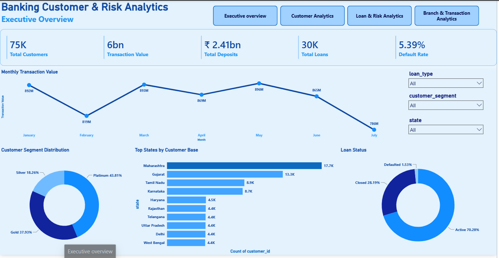
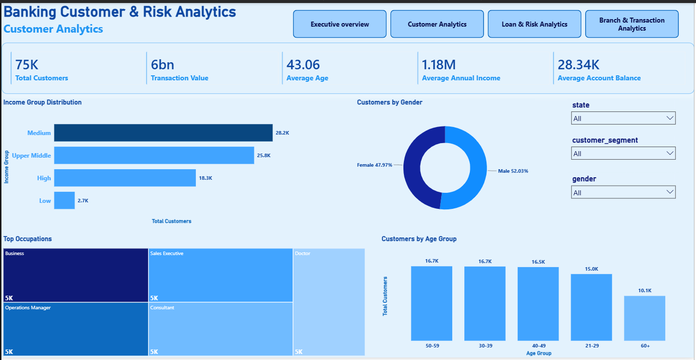
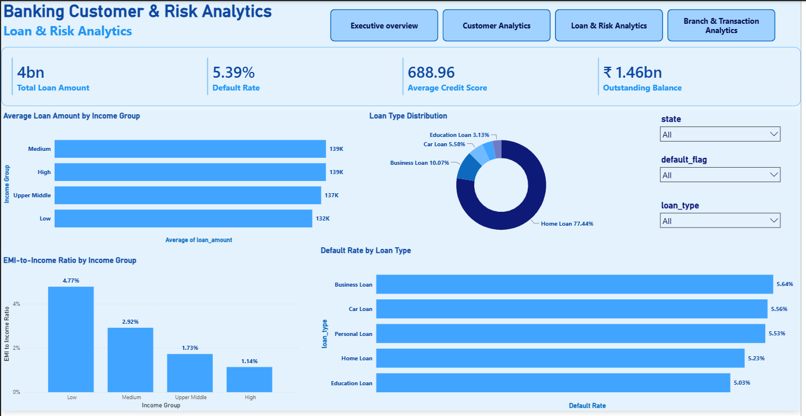
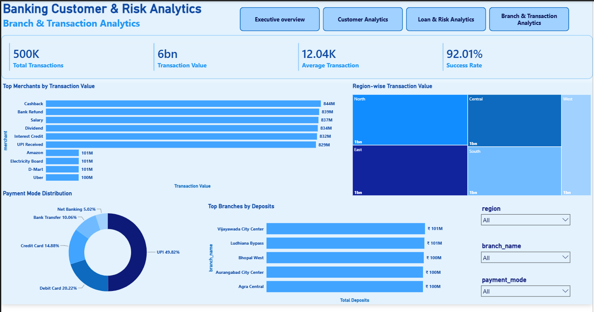

# 🏦 Banking Customer & Risk Analytics

An end-to-end data analytics project that turns raw banking data into an interactive **Power BI dashboard**, using **Python** for cleaning and **MySQL** for business analysis. It answers 35+ real banking questions — from *"which credit score band defaults the most?"* to *"which branches bring in the most deposits?"* — for both technical and non-technical audiences.

 **Full write-up:** see [`Banking_Customer_Risk_Analytics_Report.docx`](report/Banking_Customer_Risk_Analytics_Report.pdf) for the complete business report (executive summary, methodology, insights and recommendations).

---

## Project Objective

- Understand who the bank's customers are and how they behave
- Monitor loan performance and identify default risk early
- Evaluate which branches and regions perform best
- Give business users a self-serve dashboard — no SQL or coding required

---

## Tech Stack

| Layer | Tools |
|---|---|
| Data cleaning & EDA | Python (Pandas, NumPy, Matplotlib) |
| Business analysis | MySQL / SQL |
| Reporting | Power BI (DAX) |
| Development | VS Code |

---

## Dataset
Actual project have following data as data set is to large unable to upload so uploaded sample dataset

Five relational tables, linked by customer, account and branch IDs:

| Table | Records | Description |
|---|---|---|
| Customers | 75,000 | Demographics — age, gender, income, occupation, state, segment |
| Accounts | 85,000 | Account type & balance (savings, checking, credit card, FD, loan account) |
| Loans | 30,000 | Loan type, amount, credit score, EMI, default status |
| Transactions | 500,000 | Payment mode, merchant, amount, date |
| Branches | 100 | Location, region, size, deposits |

---

## Workflow

```
CSV Files
   │
   ▼
Python  (cleaning • validation • feature engineering • EDA)
   │
   ▼
MySQL   (35+ business-question SQL queries)
   │
   ▼
Power BI  (interactive 4-page dashboard)
```

---

## Dashboard

A  interactive Power BI report, each page built for a different audience:

| Page | Audience | What it shows |
|---|---|---|
| Executive Overview | Leadership | Headline KPIs, monthly transaction trend, customer segments, loan status |
| Customer Analytics | Marketing / Relationship teams | Income groups, gender split, occupations, age groups |
| Loan & Risk Analytics | Credit & risk teams | Loan amount by income group, EMI-to-income ratio, default rate by loan type |
| Branch & Transaction Analytics | Branch / Payments teams | Top merchants, payment modes, region-wise transaction value, top branches by deposits |

**Executive Overview**


**Customer Analytics**


**Loan & Risk Analytics**


**Branch & Transaction Analytics**


> Screenshots live in `/images` — update the paths above if you use a different folder.

---

## ⭐ Key Features

- End-to-end pipeline: raw CSVs → Python cleaning → MySQL analysis → Power BI dashboard
- 35+ SQL business questions covering customers, loans, transactions and branches
- Engineered business fields: age group, income group, EMI-to-income ratio, credit score category, high-risk/low-risk loan flag
- Fully interactive dashboard with cross-page filters (region, branch, state, gender, loan type)
- KPI cards for at-a-glance monitoring

---

## 💼 Business Questions Answered

- Which customer segments are most valuable?
- Which loan types and credit-score bands have the highest default rate?
- Which branches and regions generate the most deposits and transaction value?
- Which payment methods are most used, and what's the transaction success rate?
- How does EMI-to-income burden vary across income groups?

*(Full SQL for all questions is in [`/sql`](sql).)*

---

## 📈 Key Insights

- Home Loans make up **77%** of the loan portfolio — the bank's risk is closely tied to housing.
- Overall loan **default rate is 5.39%**, but customers with "Poor" credit scores default at **21.68%** — about 4x the average.
- **UPI is the leading payment method** (49.8% of all transactions), ahead of debit and credit cards.
- A small group of top branches (Vijayawada, Ludhiana, Bhopal, Aurangabad, Agra) each hold ₹100M+ in deposits.
- Platinum customers are the largest segment (43.8%), pointing to a broadly affluent, loyal customer base.
- The West region trails other regions in transaction value, suggesting room for growth.

*(See the full report for the complete list of insights and recommendations.[`/report`](report/Banking_Customer_Risk_Analytics_Report.pdf))*

---

## 📁 Repository Structure

```
├── sample_data/         # leaned CSV files(1000)
├── notebooks/           # Python cleaning & EDA scripts/notebooks
├── sql/                 # SQL scripts for all business questions
├── powerbi/             # Power BI (.pbix) file
├── screenshots/         # Dashboard page screenshots (used above)
├── Banking_Customer_Risk_Analytics_Report.docx   # Full business report
└── README.md
```

---

## 🚀 How to Run

1. Clone this repository and install Python requirements: `pip install -r requirements.txt`
2. Run the notebooks/scripts in `/notebook` to clean the raw data in `/sample_dataset`
3. Load the cleaned CSVs into MySQL using the schema provided, then run the scripts in `/sql`
4. Open the `.pbix` file in `/powerBI` with Power BI Desktop, point it at your MySQL instance, and refresh

---

## 🚀 Future Improvements

- Microsoft Fabric / Azure SQL Database integration for cloud-scale storage
- A predictive loan-default model (machine learning) to flag risk before a loan is approved
- Real-time / streaming dashboard refresh
- Customer churn prediction

---

## 👩‍💻 Author

**Gayatri Kasbekar**
- 📧 gayatrikasbekar13@gmail.com
- 💻 GitHub: [github.com/Gayatrik04](https://github.com/Gayatrik04)
- 🔗 LinkedIn:[linkedine.com/https://www.linkedin.com/in/gayatri-kasbekar-674a883a3/](https://www.linkedin.com/in/gayatri-kasbekar-674a883a3/) 
